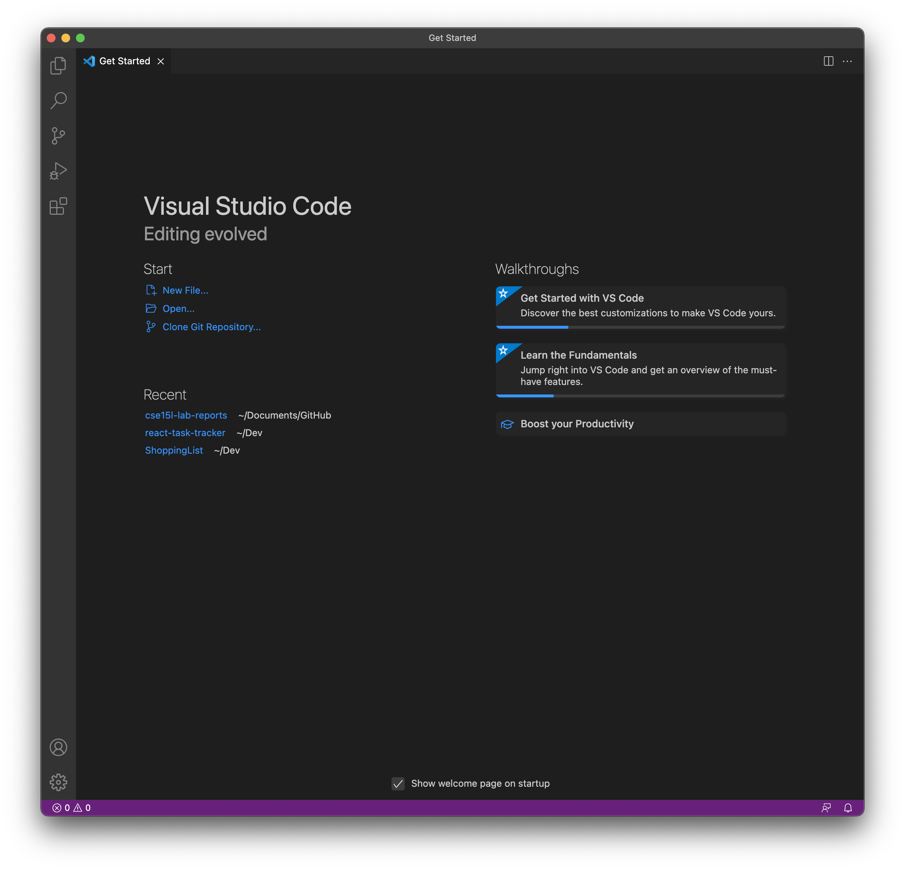
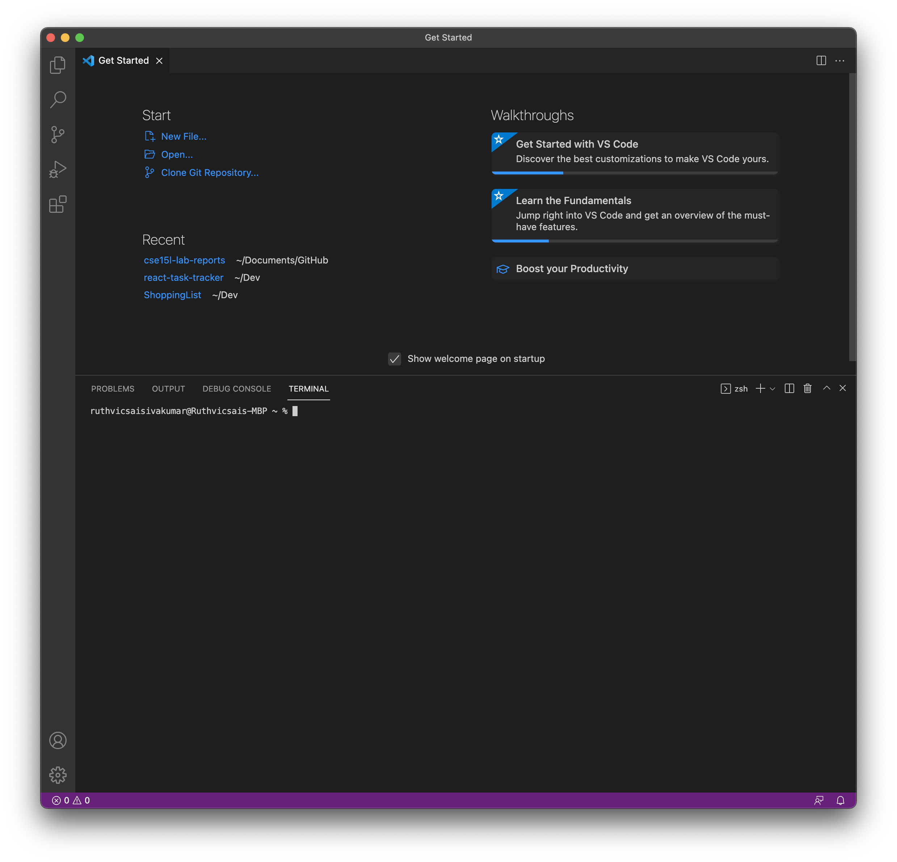

# Lab 1 Report
## Download VScode

[VScode](https://code.visualstudio.com) is what we will use to make it easier to use ieng6 and also edit our files. So it is usefull to get VScode, but the terminal could also be used. 

1. Use the link above and download the right version for your computer. Then install by going through the prompts. You should end up with the follwing: 


2. Click icons on the bottom left of the screen in the purple bar on the icons.

3. Then click the terminal tab to open the terminal in VScode


---

## Remotely Connecting to ieng6

1. In the terminal type in the following. Make sure that in place of "zz" you use your specific 3 letter account
```
$ ssh cs15lwi22zz@ieng6.ucsd.edu
```

2. Type in yes if asked about continuing to connect. 

3. It will then prompt you 