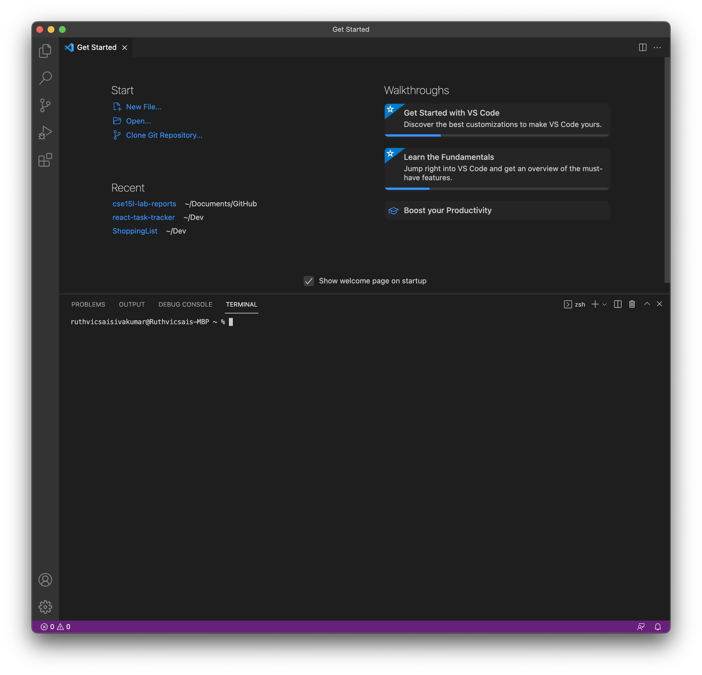

# Lab 1 Report
## Download VScode

[VScode](https://code.visualstudio.com) is what we will use to make it easier to use ieng6 and also edit our files. So it is usefull to get VScode, but the terminal could also be used. 

1. Use the link above and download the right version for your computer. Then install by going through the prompts. You should end up with the follwing: 


2. Click icons on the bottom left of the screen in the purple bar on the icons.

3. Then click the terminal tab to open the terminal in VScode


---

## Remotely Connecting to ieng6

1. In the terminal type in the following. Make sure that in place of "zz" you use your specific 3 letter account
```
$ ssh cs15lwi22zz@ieng6.ucsd.edu
```

2. Type in yes if asked about continuing to connect. 

3. It will then prompt you for your password. Remember that it might not look like you are entering anything into your password when you are typing, but it is being entered. 

4. Once logged in, it will look something like this. 


---
## Trying Commands

Here are a couple commands you could try in your terminal. 


- ```ls ```(lists all files)
- ```ls -a ``` (lists all hidden files)
-  ```ls -l ``` (lists all files and more information)
- ```cd ``` (move to certain directory)
-  ``` touch ``` (creates a file)
-   ```  mkdir ``` (creates a directory)
-   ```  exit ``` (exits the remote session)

There are many more commands but these are a few of the useful everyday ones. A couple examples of what you should expect are attached below. 


---
## Moving Files with scp

There is an easy way to move files from your machine to your ieng6 computer. One way to do this is with ```  scp ```  command. 

1. First make a file on your lcoal machine in your terminal with the ``` touch ``` command. For example: ``` touch hello.txt``` to create a text file called hello. 

2. In the directory that the file is in type in the command ``` scp hello.txt cs15lwi22zz@ieng6.ucsd.edu:~/ ```. **Make sure zz is replaced by your user and that in place of hello.txt your file is there.**


3. You will be prompted to sign in with your password and do so. Afterwards, ``` ls ``` should reveal your file in the server.


---
## Setting SSH key
SSH keys make signing into the ssh much easier and gets rid of the need of a password every time. We will use a program called ssh-keygen. 

1. Type in ``` ssh-keygen``` into the terminal on your computer. You should get some art. Similar to what is shown below. 
```
+---[RSA 3072]----+
|                 |
|       . . + .   |
|      . . B o .  |
|     . . B * +.. |
|      o S = *.B. |
|       = = O.*.*+|
|        + * *.BE+|
|           +.+.o |
|             ..  |
+----[SHA256]-----+
```

2. Now the key generated needs to be shared to your server. We can do this by using scp. But first you need to make a directory to put the key in. So log into your machine and create a directory called .ssh with the follwing command ```mkdir .ssh```. Then log out of your server and in your local machine, scp the file named ``` id_rsa.pub ```. Make sure you are in the same directory as that file or you have the full path name when you ssh like this: ```$ scp /Users/sam/.ssh/id_rsa.pub cs15lwi22@ieng6.ucsd.edu:~/.ssh/authorized_keys```. You also need to make sure to add the directory on the server which you want to drop the file in. 

3. Now you should be able to log into your server without having to put in the password.

---
## Optimizing Remote Running

* One way to make remote running easier doing a certain command on the server and then logging out right after The way to do this is by adding " " around the command you want done after ssh. For example: ``` $ ssh cs15lwi22xx@ieng6.ucsd.edu "ls" ```. In the image below you can see how the ls command listed all the files in my home directory and then logged out and returned to my local machine.


* Another way is to use semicolons and run many commands on the same line. For example: ```$ cp WhereAmI.java OtherMain.java; ls; java WhereAmI; mkdir hello```. This would do all of these in order.

* A useful way to quickly refresh long commands that you use often is by using the arrow keys on your keyboard to go into your command history. This is useful if you are using the same long command over and over. It is also helpful if you forget what the exact command was. 

---
## Optimizing Remote Running, Keystrokes

If you're editing a file on your machine, what is the fastest way to run it on the server? In the fewest keystrokes? 

* One easy tip is to use the arrow keys to retrieve the command used, this would be just 2 keystrokes (up and run) or maybe 3-4. But you must write the command at first to run this. This would save a lot of time after the first time typing in the command.


* In the image above you can see how with two lines I was able to save and run. Although this is more than 10 keystrokes, after this stage, you could just use the up key to get the previous command just like I did for the second run!

* Another way would be to copy paste the command by either keeping it saved somewhere or to scroll up and copy. This would be 3 clicks, copy, paste, enter.

* This is only possible since we have ssh already set up so we do not have to put the password in every time. we are also condensing many commands onto one line so that we do not need to keep looking through our past commands. 