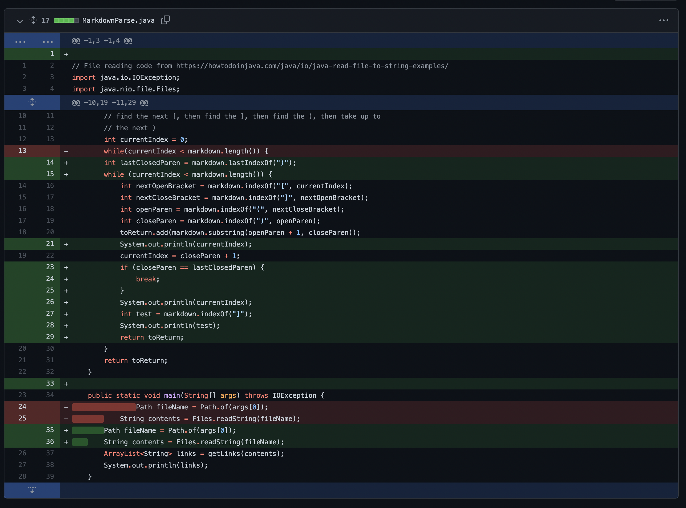
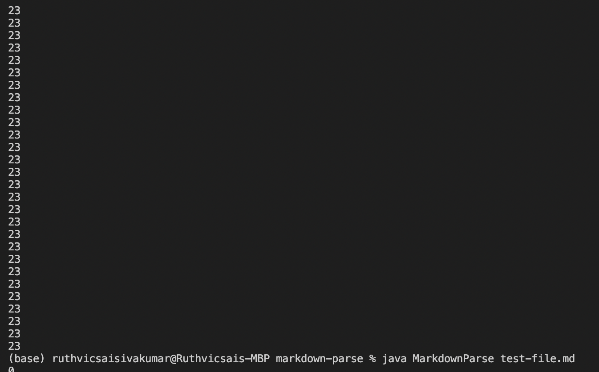
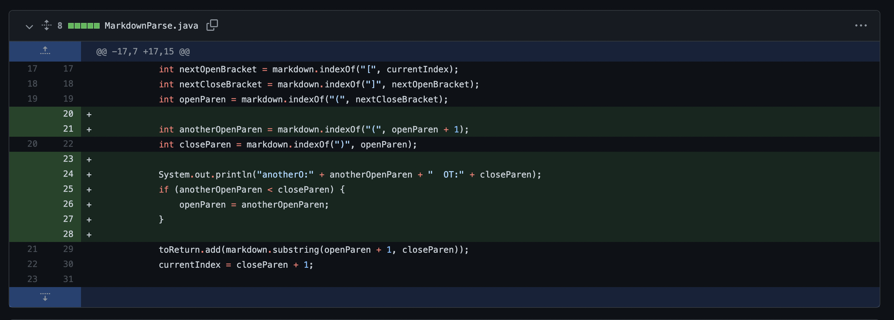
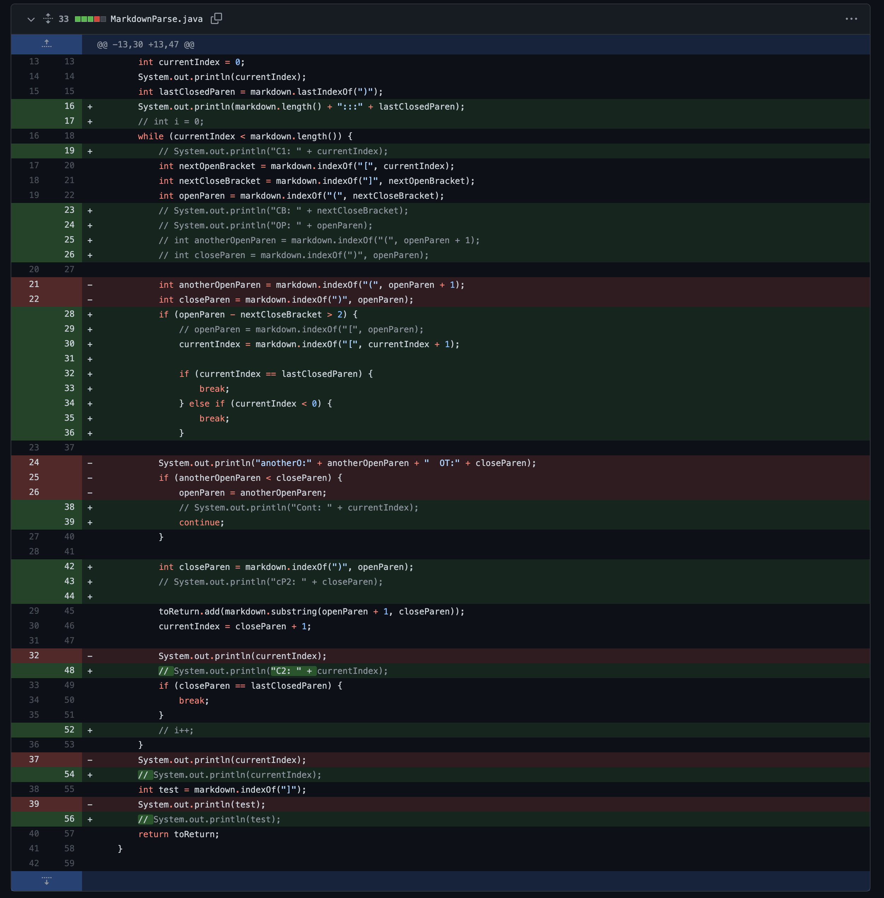
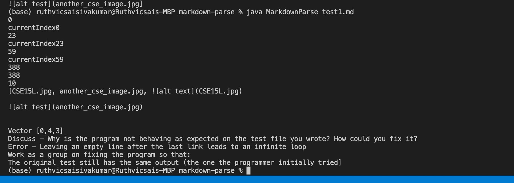

# Lab Report 2
---
---
## First Issue
---

###  The Code Change


###  The File Which Caused the Issue
[The File](https://raw.githubusercontent.com/ruthvics/markdown-parse/main/test3.md) 


###  The symptom
The Sympotm was that the program was sent into a infinite loop:


### & The Bug
The Symptom was essentally an infinite loop which was casued by a new line character after the last link in the file. This made the program keep looking and threw itself into a loop since the size of the markdown was not set. Adding a case where the program would stop at the last ")" in the file stopped this from happening. The only was to quit the loop was to stop the program which I did with ```CTRL + C ```.

## Second Issue
---
###  The Code Change


###  The File Which Caused the Issue
[The File](https://raw.githubusercontent.com/ruthvics/markdown-parse/main/test2.md) 


###  The symptom
    (base) ruthvicsaisivakumar@Ruthvicsais-MBP markdown-parse % java MarkdownParse test2.md
    0
    33
    89
    89
    9
    [https://something.com, 

    ( ()". So the program would pick the furthest most parentheses as the link. So ")**(** (**)**" and everything between those. The way to fix this was to get the index of the next closed and open parantheses. Then just check to see if the index of open is before closed. If it is, we just ignore that one and keep going. 

## Third Issue
---
###  The Code Change


###  The File Which Caused the Issue
[The File](https://raw.githubusercontent.com/ruthvics/markdown-parse/main/test1.md) 


###  The symptom
 The many infinite loops wiped out the output however I do have a screenshot of the sympotom: 

###  The Bug
The main factor in this bug us that there are brackets and then paranthesis much later in the file but the program treats it like they are next to each other. In MarkUp, the brackets and parentheses must be touching. While fixing this issue I broke the fix I made for the last bug. So, I had to redo that and ended up finding a comonality between both the bugs and inputs. They both occur when a closed bracket is not right before a open parenthesis. So I made sure the program checks for the location of the paranthesis and what is around it. 