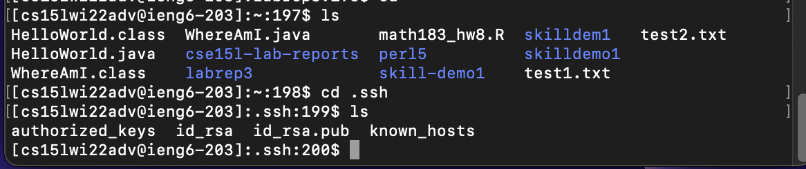

# Lab Report 2

## Setting up Github Access from ieng6
1. First I made a key by doing ``` ssh-keygen``` and ended up putting it in the default directory with the keys from before. So this naturally put it in ```.ssh``` in my ieng6 account. I then went to the directory and did ``` cat id_rsa.pub``` to get the text inside of the file to copy paste into github. I also did this for my local machine
**This is where the public key is stored in githib and my user account:**   

2. The private key is also stored in ```.ssh``` with the other files as shown:  I can now log into my ieng6 account using ssh to local machine, ieng6 to github, and local machine to github.

3. This is the process of changing and updating a repo from my ieng account:  I had a lot of trouble here as you can not do the usual ```git clone https://github.com/ruthvics/<projectname>```. This would cause issues and force you to use username and password which do not work. You either had to change this using commands. Or you would have to do ```git clone git@github.com:ruthvics/<projectname>```. 

4. The link to the [repo](https://github.com/ruthvics/labrep3)  and the specific [commit](https://github.com/ruthvics/labrep3/commit/e500a796d8da7a11abbd7b0a65c8d020ba1178ed) are here.