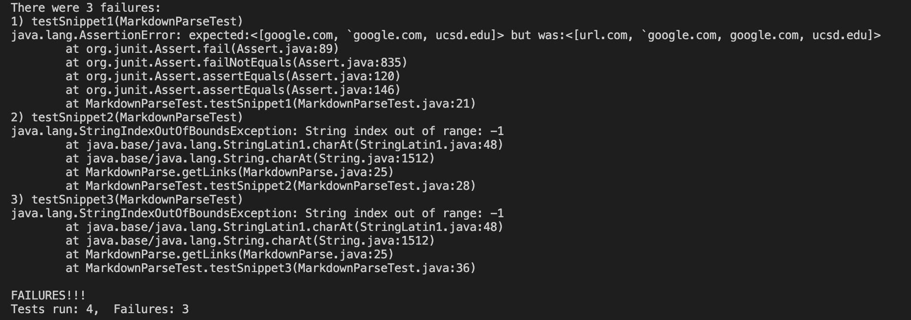
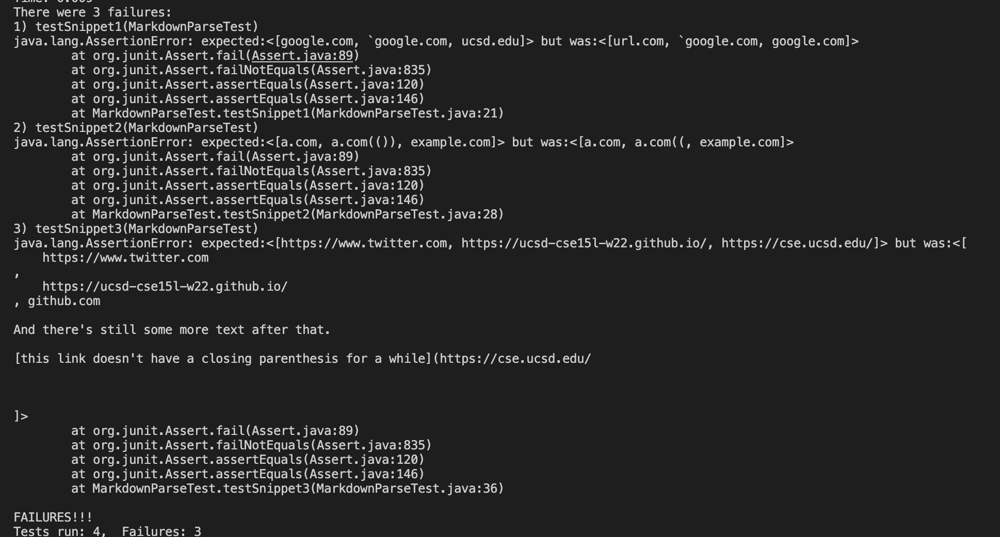
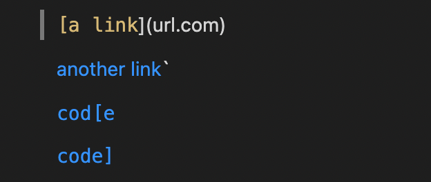
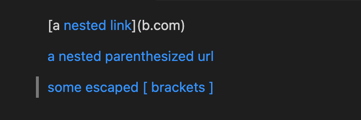
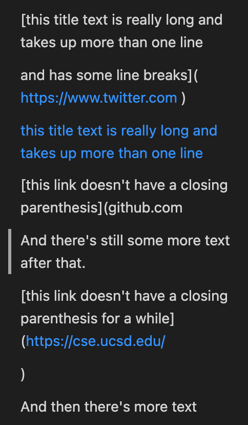

# Lab 4 Report

[My code](https://github.com/ruthvics/markdown-parse)

[Code we reviewed](https://github.com/jdweak/markdown-parse)

## Reviewed Code
The reviewed code did not pass any of the new testfiles. The first snipped failed through a bug and the rest threw outofbounds exceptions. This is probably since they are checking if the there is a "!" before the "[" which ends up outofbounds if the first thing in the file is a "[".



## My code
When the JUnit test was run, my file failed all of the test cases.



### Snippet 1 & Backticks
From the preview the desired output can be derived: 


 The desired output  should be ```google.com, `google.com, ucsd.edu``` as seen in the VScode preview. 

- There could be a small edit done to solve for this issue by checking for backticks in a similar fashion to brackets. Whichever is found first gets precidence if there is a pair. This way if there are backticks then the brackets are not read.

### Snippet 2 & Nests & Escapes
From the preview the desired output can be derived: 


 The desired output  should be ```a.com, a.com(()), example.com``` as seen in the VScode preview.

 - The way to fix this would be to look for the furthest instead of next. First we would need to find the furthest closing parenthesis before a opening bracket instead of the next occurance of a closing parenthesis. So we would need keep finding the next closng parenthesis and find the closest one to the next opening parenthisis. 

 ### Snippet 3 & Newlines
From the preview the desired output can be derived: 


 The desired output  should be ```https://www.twitter.com, https://ucsd-cse15l-w22.github.io/, https://cse.ucsd.edu/``` as seen in the VScode preview.

 - The best way to solve for this would be to strip the string before putting it in the array so only the main link is present with no spaces or newlines. Another factor would be to only check for closing parenthesis in the next line only if any characters are present on it. If there is none then it is an invalid link and the next set of parenthsis and brackets are found. 