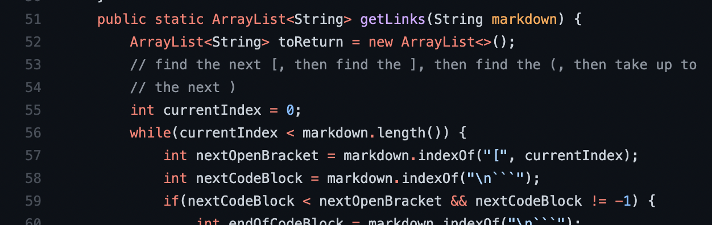

# Lab Report 5
## How the Difference was found
I did what we did in lab 5 and created a bashfile to run through all the test and output them to a text file. Then I used the diff command to compare all the differences.

## 1st Difference
This was one of the differences:

    < test-files/579.md :[<url>]
    ---
    > test-files/579.md :[]


The right answer from looking at VSCode is:


**The correct answer would be the second one since this is being accepted as an image instead of a link. Checking the file itself also shows that my implementaion is correct.** This seems to be an issue of not checking or not properly checking if the image is a picture. The exclamation mark needs to be checked properly at the begining without causeing a outofbounds error. There could be a relativiley simple fix. 

1) Check if at positon 0 in the file, if not:
2) Check if the postion behind the "[" is a "!". If not then continue, if it is then skip to the next "[".

### What to change
Right after finding the index of the opening bracket in the getLinks method: 


After line 57. This code should be placeed

    if (nextOpenBracket > 0) {
        if ('!' == markdown.char(--nextOpenBracket) {
             break;
                }
            }

## Second Difference
This was a unique difference:

    < test-files/567.md :[]
    ---
    > test-files/567.md :[not a link]

VSCodes answer:


**It seems like both implementations were wrong. There is a valid link here which is not what is in the second implementation.** The correct link would be ```\url1``` as shown in the screenshot. 

When opening this particular testfile we see a unique situation inside. 

    [foo](not a link)

    [foo]: /url1


Although it seems like the first line looks like a valid complete link. The actual markdown syntax doesnt think so. Initally I assumed that the first "foo" was being read as the name and the the rest is being skipped till the "/url1" part. But, this makes no sense since it would be skipping a valid syntax. 

After some thinking I remebered that there was a way to set an image to a name and then display it later. I rememeberd seeing this in one of our first labs to I took a dive into the old cheetsheets and labs. 


After looking at the cheet sheet I realized the same method works with Links.

    [Link][1]
    ⋮
    [1]: http://b.org

In the last line we see a way of setting links most of us have **totally forgotten** and haven't even **considered** in our parsers!

So it seems like what is happening is simlar setting definitions in c++. It gives priority to the second method even if both is present, and whenever the string in "[...]" shows up anywhere, the link is placed instead. So in our testcase, the ```[foo]``` is being replaced with the link already and the ```(not a link)``` is just text. 

In both ways they will have a similar fix, similar to what we have done for the first method of declaring links, it will need to be done for the second method:

1) A parser that looks for the specific form ```[...]: somelink.com``` needs to be made. Open bracket, closed bracket, immediately followed by a ":" and then a link. We would need to remember the string in the brackets to cross reference later.

2) The overall parser should give priority to the method above first by looking for strings in that form first. Then looking for links in the way we have been so far. If any of those string we saved in step 1 appear in the link format, the link is deemed as invalid.

3) For the new method, there are many rules which also need to be tested and accounted for such as: link on the next line, no link, very long paragaph of a link, what if a link contains the same characters, etc. 


### What to change

There is not much to show here as a while new parser needs to be added and a lot of code must be changed to make this work. We could create a whole another method, or just incorportate it into our current getlinks method.